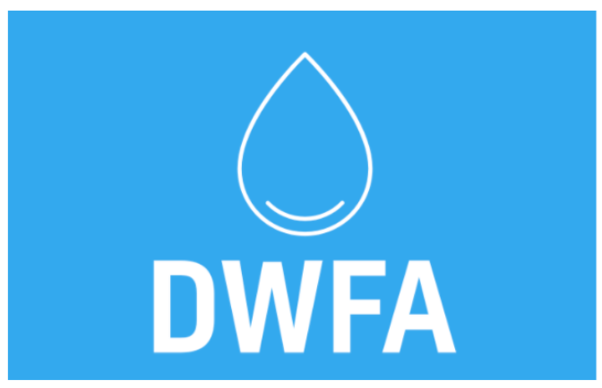

# Drinking_Water_Study_with_Tableau
## Tableau Dashboard
### [You can reach the tableau dasboard here](https://public.tableau.com/app/profile/erdem2938/viz/P8_Drinking_Water_For_All_16564063341260/DWFA)

**Scenario**

    

      
    
* Je suis consultant Data Analyst en mission dans l’ONG DWFA. DWFA (Drinking Water For All) est une ONG et son objectif est de donner accès à l’eau potable à tout le monde.

* L’association a effectué une demande de financement auprès d’un bailleur de fonds en présentant ces 3 domaines d’expertise 

* Pour la partie analyse, je suis demandé de
    
    * Création de services d’accès à l’eau potable 
    * Modernisation de services d’accès à l’eau déjà existants
    * Consulting auprès d’administrations/gouvernements à propos des politiques d’accès à l’eau. 

 * Pour ce contexte elle a besoin d’un dashboard pour identifier les pays qui rencontrent des difficultés d’accès à l’eau potable. Ça permettra d’identifier les pays dans lesquels concentrer ses efforts. 
 * Pour avoir plus d’informations sur des données, vous pouvez regarder les sites de l’OMS et de la FAO.

